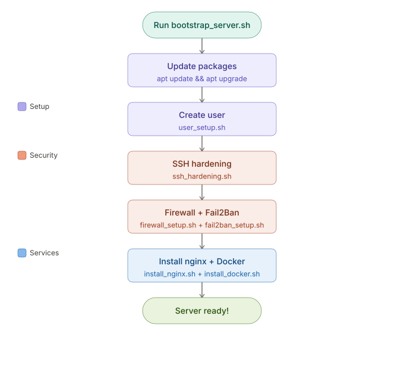

# Linux Server Bootstrap Automation


A beginner-friendly Linux server automation project built using Bash scripting, tested on WSL2 Ubuntu 22.04

This repository is created for learning and practicing Linux administration, Bash scripting, server provisioning, and basic DevOps concepts.

The project contains automation scripts for common Linux server setup tasks such as:

* package installation
* user creation
* SSH hardening
* firewall configuration
* Docker installation
* nginx reverse proxy setup
* Fail2Ban configuration

Some scripts are inspired by official documentation and real-world server provisioning practices and are being used for educational purposes while learning DevOps and Linux automation.

---

# Project Goals

The main goal of this project is to practice:

* Linux system administration
* Bash scripting
* service management using systemd
* server security basics
* automation concepts used before tools like Ansible/Terraform

This is a learning project and not a production-ready framework.

---

# Current Features

## Server Setup & Automation

* Basic server bootstrap automation
* Package installation using apt
* Service management using systemctl

## Security

* SSH hardening
* Firewall setup
* Fail2Ban installation and configuration

## Web Server & Reverse Proxy

* nginx installation
* nginx reverse proxy configuration

## Container Tools

* Docker installation automation

---
## How It Works



# Technologies Used

* Bash Shell Scripting
* Ubuntu Linux / WSL
* systemd
* nginx
* Docker
* UFW / iptables
* Git & GitHub

---

# Project Structure

```text
linux-server-bootstrap/
│
├── bootstrap_server.sh
├── README.md
│
├── scripts/
│   ├── install_nginx.sh
│   ├── install_docker.sh
│   ├── user_setup.sh
│   ├── firewall_setup.sh
│   ├── ssh_hardening.sh
│   ├── fail2ban_setup.sh
│   └── nginx_reverse_proxy.sh
│
├── configs/
└── docs/
```

---

# Current Status

Currently, the project mainly contains Bash automation scripts for learning and experimentation.

Future improvements may include:

* configuration templates
* logging improvements
* Ansible playbooks
* Docker Compose setups
* Terraform integration
* CI/CD automation

---

# How to Run Scripts

## Give execute permission

```bash
chmod +x script_name.sh
```

Example:

```bash
chmod +x scripts/install_nginx.sh
```

---

## Run the script

```bash
./scripts/install_nginx.sh
```

Some scripts may require sudo privileges:

```bash
sudo ./scripts/install_nginx.sh
```

---
## Screenshots

### Bootstrap Automation


---

### Docker Installation Verification


---

### SSH Hardening


---

### Firewall Status


# Important Notes

* These scripts are created for learning and practice purposes.
* Always test automation scripts in a VM, WSL, or non-production environment first.
* Some scripts modify important system configurations such as SSH, firewall, and nginx settings.
* Read and understand scripts before executing them on real servers.

---

# Learning Focus

This project helped practice concepts such as:

* Linux permissions
* systemctl and services
* SSH configuration
* reverse proxies
* package management
* Bash scripting
* infrastructure automation basics

---

# Author

Gunjan Jain

Learning Linux, DevOps, and Infrastructure Automation.
